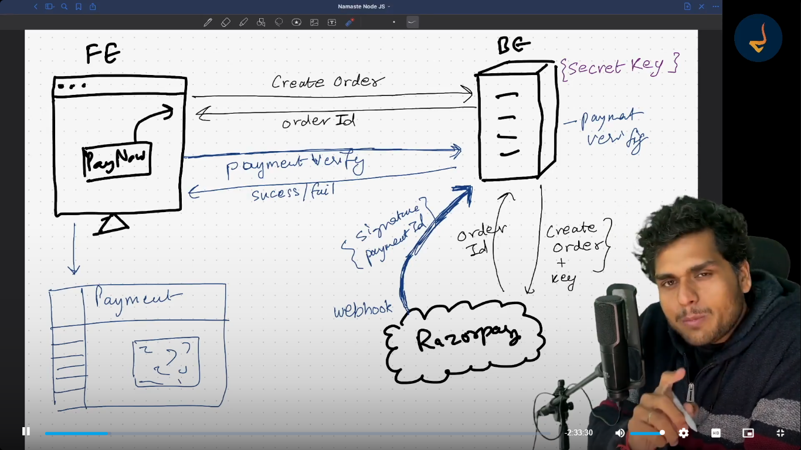

# Episode-07 | Payment Gateway Integration ft. Razorpay

## Steps in completing payments
1. Create Order - createOrder API
2. Payment Verification - verifyPayment API

## Razor Pay Payment Flow with FRONTEND (FE), BACKEND (BE) and RAZORPAY (RP)

1. FE has a "Pay Now" button
2. FE will make an API call to the BE to create an order
3. BE has a secret key. Only BE will communicate with Razorpay.
4. BE will make an API call to RP with the secret key.
5. RP sends order ID back to BE as a response
6. BE sends back the order ID to the FE as a response
7. FE will open a dialog box for payment which has options like Debit Card, Credit Card, Net Banking etc. This is generated by RP code (not sure how this works).
8. RP knows the payment was completed because its their dialog box. Upon successful payment, RP has a webhook which will inform BE that a payment was created for a specific order ID. It calls the BE with a signature and a payment ID.
9. BE will perform payment verifcation. If the payment is successfully completed, BE will mark the user as premium and store the transaction as completed/captured.
10. After few seconds, FE will make an API call to the BE to check if payment was successful or not.
11. BE will respond with the success/failure.
